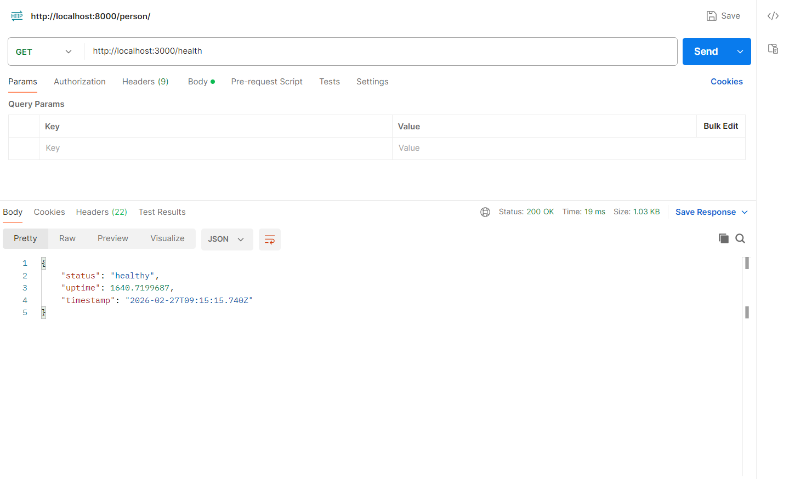
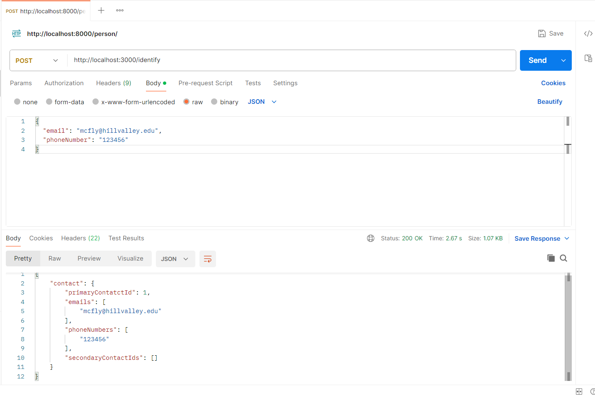
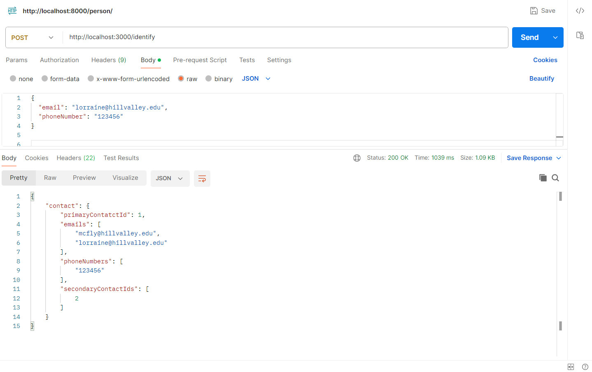
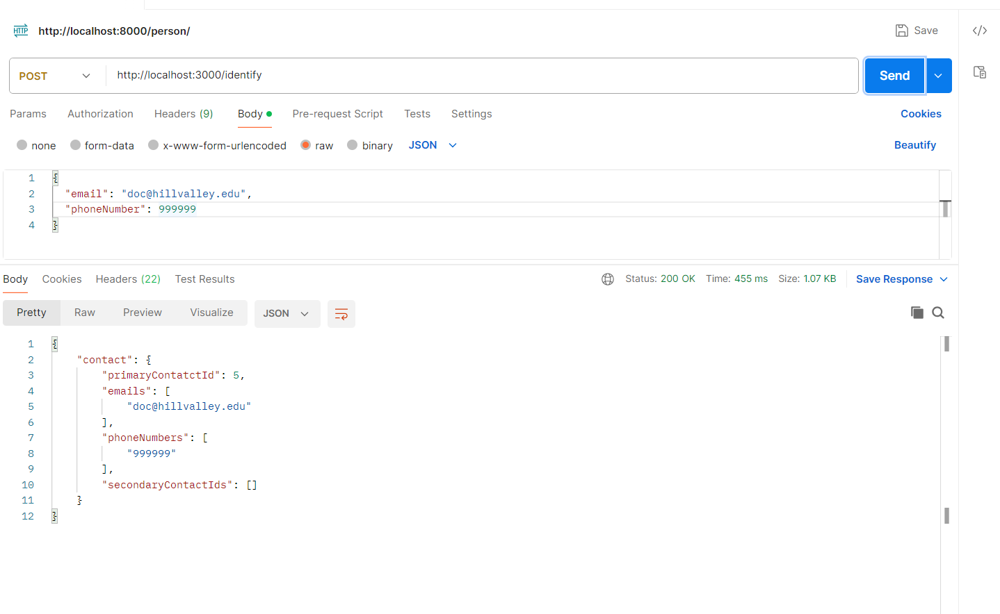
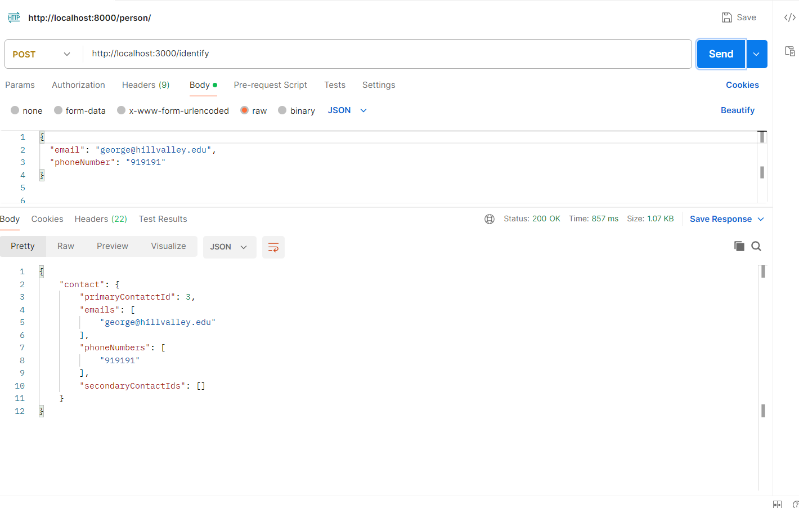
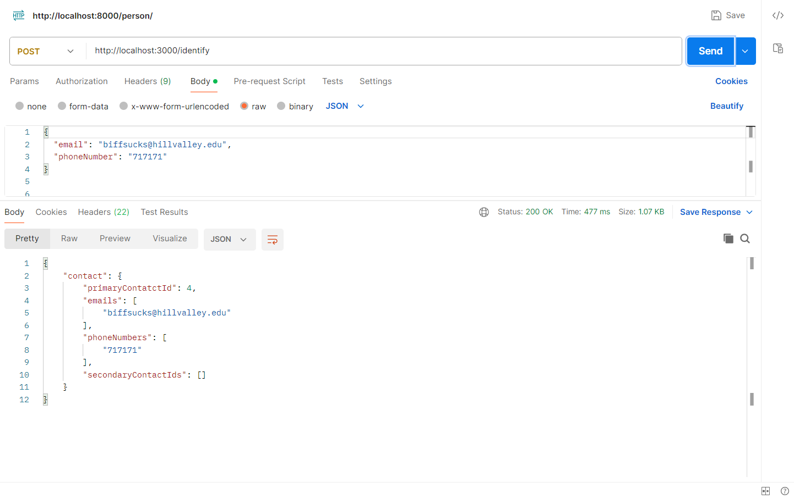
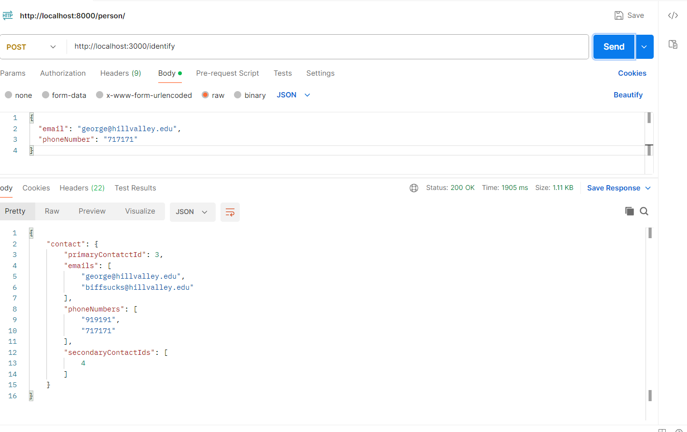
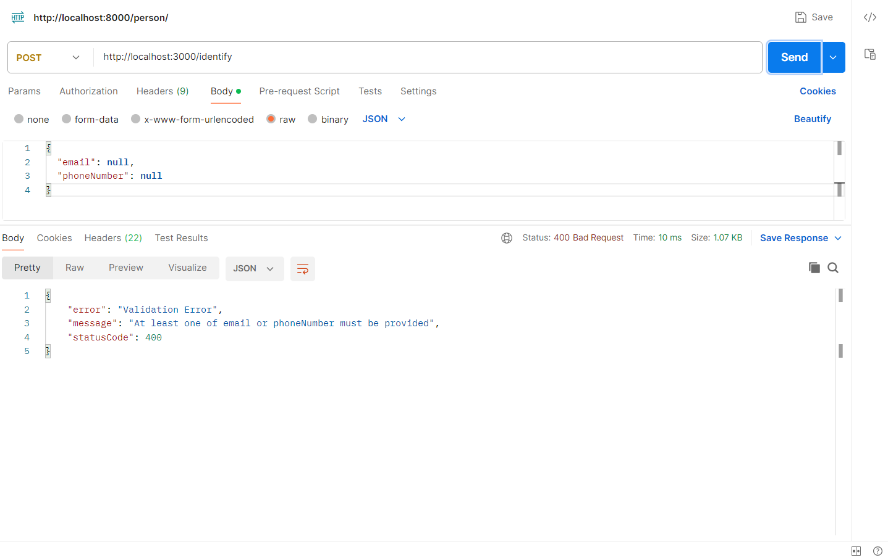

<div align="center">

# 🔎 Bitespeed Identity Reconciliation

</div>

<div align="center">


> A production-ready identity reconciliation microservice that links customer contacts across multiple purchases, even when they use different emails and phone numbers.

**[🌐 Live API](https://bitespeed-identity-xpss.onrender.com)** • **[📋 API Docs](#-api-reference)** • **[🧠 Algorithm](#-algorithm-deep-dive)**

</div>

---

## 🌐 Live Endpoint

```
POST https://bitespeed-identity-xpss.onrender.com/identify
GET  https://bitespeed-identity-xpss.onrender.com/health
```
---

## ✨ What Makes This Stand Out

- ✅ **Full spec compliance** — all edge cases handled: new contacts, secondary creation, cluster merging, primary-to-secondary conversion
- 🔒 **Production hardened** — Helmet security headers, rate limiting (100 req/15min), graceful shutdown
- 🧪 **Comprehensive test suite** — covers every scenario from the Bitespeed spec using Jest + Supertest
- 📐 **Clean architecture** — `Controller → Service → DB` separation of concerns
- ⚡ **Zod input validation** — strict type-safe request parsing (accepts `phoneNumber` as `string` or `number`)
- 🔗 **Optimized Prisma schema** — self-referential Contact model with indexes on `email`, `phoneNumber`, `linkedId`
- 🚀 **One-click Render deploy** via `render.yaml` blueprint

---

## 🗂 Project Structure

```
bitespeed-identity/
├── prisma/
│   └── schema.prisma              # DB schema with indexes & self-referential relation
├── src/
│   ├── controllers/
│   │   └── identifyController.ts  # Request handler
│   ├── middleware/
│   │   ├── validateRequest.ts     # Zod schema validation
│   │   └── errorHandler.ts        # Global error & 404 handler
│   ├── services/
│   │   └── identityService.ts     # ⭐ Core reconciliation algorithm
│   ├── utils/
│   │   ├── prismaClient.ts        # Singleton DB client
│   │   └── logger.ts              # Colored console logger
│   ├── types/
│   │   └── index.ts               # TypeScript interfaces
│   ├── app.ts                     # Express app setup
│   ├── index.ts                   # Entry point with graceful shutdown
│   └── identify.test.ts           # Full test suite
├── output_samples/                # Postman test evidence screenshots
├── render.yaml                    # One-click Render deploy config
├── .env.example                   # Environment variable template
├── jest.config.js
├── tsconfig.json
└── package.json
```

---

## 🧠 Algorithm Deep Dive

The core reconciliation logic lives in `src/services/identityService.ts` and handles 5 distinct cases:

```
1. No match found            → Create new PRIMARY contact
2. Exact match (no new info) → Return existing consolidated contact (idempotent)
3. Partial match (new info)  → Create new SECONDARY contact linked to primary
4. Two separate clusters     → MERGE: older primary wins, newer primary demoted to secondary
5. Already same cluster      → Return consolidated response
```

### Cluster Merge Example (from spec)

```
Before:
  Contact #11: george@hillvalley.edu / 919191    [PRIMARY]
  Contact #27: biffsucks@hillvalley.edu / 717171  [PRIMARY]

Request: { email: "george@hillvalley.edu", phoneNumber: "717171" }
  → Bridges both clusters!

After:
  Contact #11: george@hillvalley.edu / 919191    [PRIMARY]  ← oldest, wins
  Contact #27: biffsucks@hillvalley.edu / 717171  [SECONDARY, linkedId: 11]

Response:
  primaryContatctId: 11
  emails: ["george@hillvalley.edu", "biffsucks@hillvalley.edu"]
  phoneNumbers: ["919191", "717171"]
  secondaryContactIds: [27]
```

---

## 🚀 Quick Start (Local)

### Prerequisites

- Node.js 18+
- PostgreSQL (or a free [Supabase](https://supabase.com) project)

### Setup

```bash
# 1. Clone the repo
git clone https://github.com/Kowshik-bh18/bitespeed-identity.git
cd bitespeed-identity

# 2. Install dependencies
npm install

# 3. Set up environment
cp .env.example .env
# Edit .env and paste your Supabase SESSION POOLER DATABASE_URL

# 4. Push schema to database & generate client
npx prisma db push

# 5. Start dev server
npm run dev
```

Server starts at `http://localhost:3000` 🎉

---

## 📡 API Reference

### `POST /identify`

Identifies and reconciles a contact by email and/or phone number.

**Request Body** — at least one field required:

```json
{
  "email": "mcfly@hillvalley.edu",
  "phoneNumber": "123456"
}
```

> `phoneNumber` can be sent as either a `string` or `number`.

**Response** `200 OK`:

```json
{
  "contact": {
    "primaryContatctId": 1,
    "emails": ["lorraine@hillvalley.edu", "mcfly@hillvalley.edu"],
    "phoneNumbers": ["123456"],
    "secondaryContactIds": [23]
  }
}
```

**Error Responses:**

| Code  | Reason                                                         |
| ----- | -------------------------------------------------------------- |
| `400` | Missing/invalid input (both fields null, invalid email format) |
| `404` | Route not found (e.g. GET /identify — must use POST)           |
| `429` | Rate limit exceeded (100 requests / 15 minutes)                |
| `500` | Internal server error                                          |

---

### `GET /health`

```json
{ "status": "healthy", "uptime": 42.3, "timestamp": "2024-01-01T00:00:00.000Z" }
```

### `GET /`

```json
{
  "status": "ok",
  "service": "Bitespeed Identity Reconciliation",
  "version": "1.0.0"
}
```

---

## 🧪 Running Tests

```bash
npm test
```

Test coverage includes:

- Input validation (missing fields, invalid email, number type coercion)
- New customer creation (email only, phone only, both)
- Secondary contact creation on new info
- No duplicate secondaries on repeated identical requests
- Cluster merging — primary-to-secondary conversion
- Idempotent lookups — all equivalent requests return the same result
- Primary email/phone always appears first in response arrays

---

## 📸 Test Evidence — Postman Screenshots

All scenarios from the Bitespeed spec were manually verified using Postman. Screenshots are stored in the `output_samples/` folder.

---

### Output 1 — Health Check (`GET /health`)

> Verifies the server is running and healthy. Returns `status: healthy` with uptime and timestamp.



---

### Output 2 — New Customer Created (First Request)

> A brand new contact (`mcfly@hillvalley.edu` / `123456`) is sent for the first time. The service creates a new **primary** contact with `secondaryContactIds: []` since no existing contacts were found.



---

### Output 3 — Secondary Contact Created (New Email, Same Phone)

> A second request comes in with `lorraine@hillvalley.edu` and the same phone `123456`. Since the phone already exists, a **secondary** contact is created and linked. Both emails appear in the response, with the **first-created email appearing first**.



---

### Output 4 — Idempotent Lookup by Phone Only (`email: null`)

> Sending `{ email: null, phoneNumber: "123456" }` returns the exact same consolidated contact — proves the service correctly resolves identity using phone number alone.


---

### Output 5 — Idempotent Lookup by Primary Email Only (`phoneNumber: null`)

> Sending `{ email: "lorraine@hillvalley.edu", phoneNumber: null }` returns the same consolidated contact — proves identity resolution works via primary email alone.


---

### Output 6 — Idempotent Lookup by Secondary Email Only

> Sending `{ email: "mcfly@hillvalley.edu", phoneNumber: null }` also returns the same consolidated contact — proves that looking up via a **secondary contact's email** correctly resolves back to the primary.



---

### Output 7 — New Independent Primary Cluster (george)

> A completely new contact `george@hillvalley.edu / 919191` is created. No overlap with existing data, so it becomes its own **primary** with empty secondaries.



---

### Output 8 — Second Independent Primary Cluster (biff)

> Another new contact `biffsucks@hillvalley.edu / 717171` is created independently. At this point two separate primary clusters exist in the database.



---

### Output 9 — Cluster Merge (Primary Turns Secondary) ⭐

> This is the most complex case. Sending `{ email: "george@hillvalley.edu", phoneNumber: "717171" }` **bridges the two clusters**. Since george's contact is older, it remains **primary**. Biff's contact is **demoted to secondary** and linked to george's ID. Both emails and both phone numbers appear in the unified response.



---

### Output 10 — Validation Error (Both Fields Null)

> Sending `{ email: null, phoneNumber: null }` correctly returns a **400 Bad Request** with a descriptive error message — proving the Zod validation layer works as expected.



---

## 🛠 Tech Stack

| Layer      | Technology            | Reason                             |
| ---------- | --------------------- | ---------------------------------- |
| Runtime    | Node.js 18+           | Fast, widely supported             |
| Language   | TypeScript            | Type safety, better DX             |
| Framework  | Express.js            | Minimal, production-proven         |
| ORM        | Prisma 5              | Type-safe DB access, great DX      |
| Database   | PostgreSQL (Supabase) | Free, managed, reliable            |
| Validation | Zod                   | Runtime type safety                |
| Security   | Helmet + Rate Limiter | Production hardening               |
| Testing    | Jest + Supertest      | Full integration tests             |
| Deploy     | Render.com            | Free tier, auto-deploy from GitHub |

---

## ☁️ Deploying to Render

### Option A — Auto deploy via `render.yaml` (recommended)

1. Push repo to GitHub
2. Go to [render.com](https://render.com) → **New** → **Blueprint**
3. Connect your GitHub repo — Render detects `render.yaml` automatically
4. Add `DATABASE_URL` environment variable (your Supabase Session Pooler URL)
5. Deploy — your URL will be `https://bitespeed-identity-XXXX.onrender.com`

### Option B — Manual setup

1. New **Web Service** → connect repo
2. **Build command:** `npm install && npx prisma generate && npm run build && npx prisma db push`
3. **Start command:** `npm start`
4. Add env var `DATABASE_URL` → Deploy

---

## 📝 Implementation Notes

- The response key `primaryContatctId` intentionally uses the exact spelling from the Bitespeed spec (single `t` in "Contact")
- `phoneNumber` in request body accepts both `string` and `number` types via Zod coercion
- Soft delete support via `deletedAt` field — all queries filter `deletedAt: null`
- Database indexes on `email`, `phoneNumber`, and `linkedId` for efficient lookups at scale
- Prisma singleton pattern prevents connection pool exhaustion in development

---

## 📬 Contact

<div align="center">

### **Kowshik BH**

[](mailto:kowshikbh18@gmail.com)
[](https://www.linkedin.com/in/kowshikbh)
[](https://github.com/Kowshik-bh18)

</div>

---

## 🙏 Acknowledgements

- [Bitespeed](https://bitespeed.co/) — for the thoughtful backend challenge that tests real-world identity graph problems
- [Prisma](https://www.prisma.io/) — for the excellent TypeScript ORM that made database interactions clean and type-safe
- [Supabase](https://supabase.com/) — for the free managed PostgreSQL hosting that works seamlessly with Prisma
- [Render](https://render.com/) — for the free web service hosting with auto-deploy from GitHub
- [Zod](https://zod.dev/) — for runtime schema validation that keeps the API robust against bad inputs

---

<div align="center">

### ⭐ If you find this project helpful, please consider starring the repository!

**Made with ❤️ by [Kowshik BH](https://github.com/Kowshik-bh18)**

</div>
